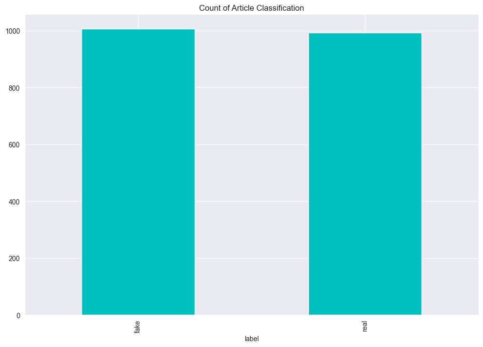
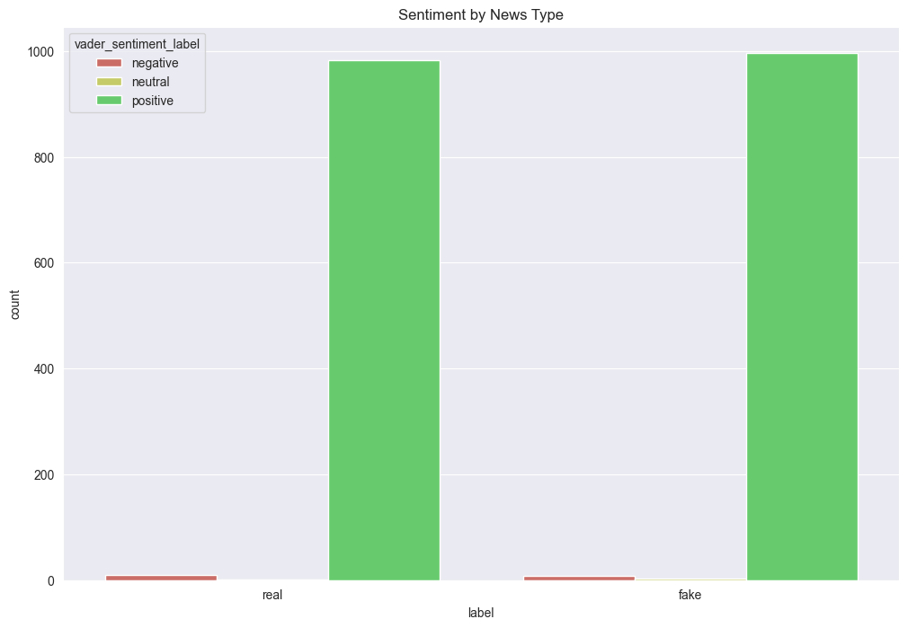
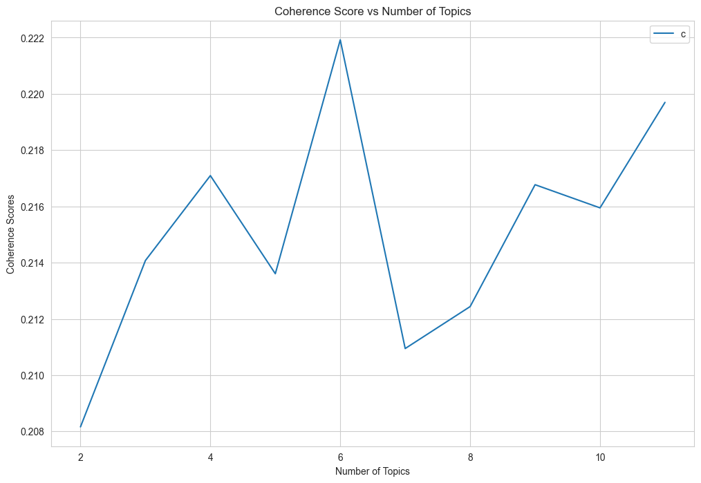
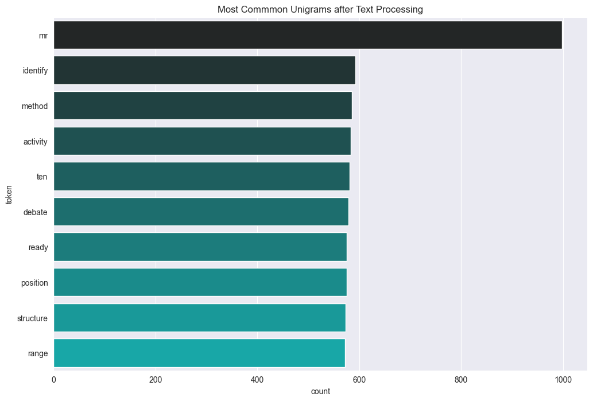

# Fake News Classification Using NLP & Machine Learning

An end-to-end Natural Language Processing (NLP) project that classifies news articles as Fake or Real using multiple text representation techniques and machine learning models.

This project demonstrates a complete NLP pipeline—from preprocessing and feature engineering to topic modeling and classification.

---

## Key Highlights
- Built a full NLP pipeline using a real-world news dataset
- Implemented both CountVectorizer and TF-IDF
- Explored topic modeling (LDA & LSA)
- Used spaCy and NLTK together for text processing
- Trained and compared multiple machine learning models
- Evaluated performance using classification metrics

---

## Problem Statement
- With the rise of misinformation online, detecting fake news has become critical.
  This project aims to classify news articles based purely on textual content using NLP   techniques.

---

## Tech Stack
- Python
- Pandas, NumPy
- NLTK & spaCy
- Scikit-learn
- Matplotlib / Seaborn
- Jupyter Notebook

---

## NLP Pipeline

### 1. Data Processing
  - Loaded labeled dataset:
    - Fake
    - Real
### 2.  Text Preprocessing
  - Tokenization (NLTK /spaCy)
  - Stopword removal
  - Lemmatization
  - Text clearing and normalization
    
### 3. Feature Engineering
  Two approaches were implemented:
   - Bag of Words (CountVectorizer)
   - TF-IDF Vectorization

   This allows comparison between simple frequency-based vs weighted features.
  
### 4. Topic Modelling
  - Latent Dirichlet Allocation (LDA)
  - Latent Semantic Analysis (LSA)
  Used to uncover hidden structure and themes within the dataset.

### 5. Model Training
   - Logistic Regression
   - Support Vector Machine
     
### 6. Model Evaluation    
  - Accuracy Score Performance comparison between models
  - Analysis of feature representation impact

---

## Results

Two classification models were tested in this project.

-Logistic Regression Accuracy: 49.00%
-SGDClassifier Accuracy: 49.17%

 - Best Model: SGDClassifier (49.17%)

The SGDClassifier slightly outperformed Logistic Regression, although both models showed very similar performance under the current setup.

---

## Visualizations

The following plots highlight key insights from the dataset and NLP pipeline.

### Dataset Distribution

### Sentiment Analysis by News Type

### Topic Modeling Coherence (LDA)

### Most Common Unigrams

---

## Project Structure

fake-news-classification-using-nlp/ 
│ 
├── notebooks/ 
│ └── Fake_news_nlp_github.ipynb 
│ 
├── images/ 
│ └── (visualizations) 
│ 
├── requirements.txt 
├── README.md

---

## HOW TO RUN
### 1. Install dependencies:
  pip install -r requirements.txt

### 2.  Open Jupyter Notebook:
  Jupyter Notebook
   
### 3. Run:
   Fake_news_nlp_github.ipynb

---

## Key Learnings
- Feature engineering (TF-IDF vs Bag-of-Words) significantly affects performance
- Linear models (Logistic Regression and SGDClassifier) can  perform competitively in NLP tasks
- Topic Modeling helps provide deeper insight into text data
- Combining multiple NLP libraries improves flexibility in preprocessing

---

## Future Improvements
- Improve preprocessing pipeline
- Perform hyperparameter tuning
- Implement transformer-based models (BERT)

---

## Author: 

✨ Charleen ✨  

- QA / Regulatory Radiopharmacist, exploring AI and machine learning applications  
- Building foundational NLP and data science projects to develop technical expertise  
- Focused on applying AI to real-world healthcare and regulatory systems
